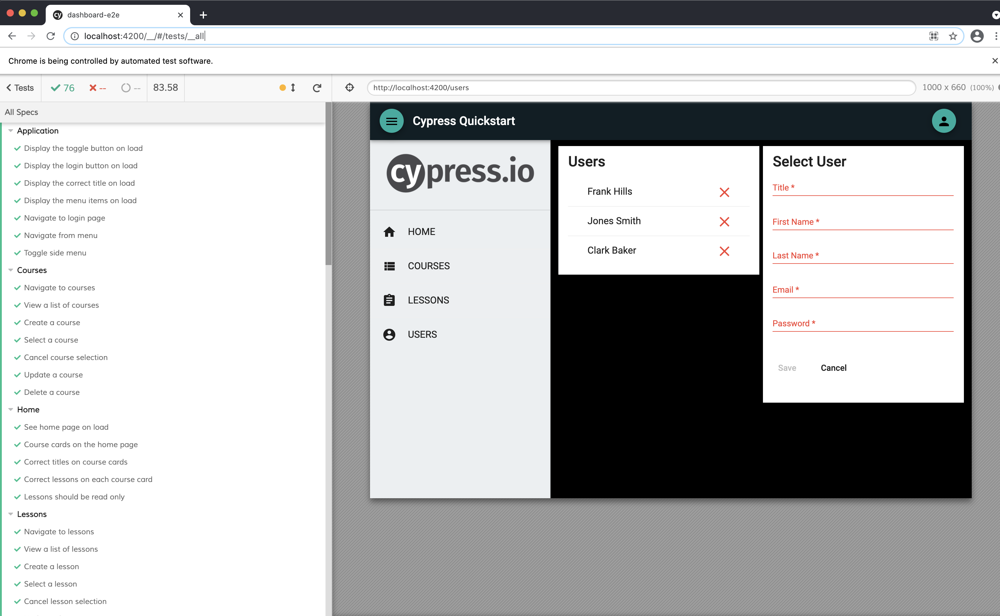
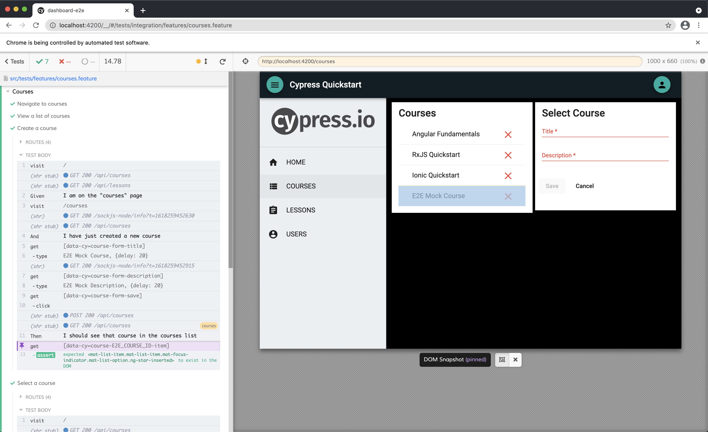

# Cypress Quickstart Workshop



This is the sample project for the Cypress Testing Quickstart Workshop.

The sample project includes an Angular web application and a mock RESTful API  within an Nx workspace by NRWL. The Angular application uses state and data libs to manage state and handle server communication. The state lib is built around NgRx and the application is entirely reactive. 

## Prerequisites
- [Git](https://git-scm.com/book/en/v2/Getting-Started-Installing-Git)
- Node.js and NPM – we recommend using [NVM (Linux/Mac)](https://github.com/creationix/nvm) or [NVM-Windows (Windows)](https://github.com/coreybutler/nvm-windows)
- Install Angular CLI via `npm i -g @angular/cli`
- Install Ionic CLI va `npm i -g @ionic/cli`

## Web: Getting Started

```
git clone https://github.com/one-hungry-mind/cypress-quickstart-workshop.git
cd cypress-quickstart-workshop
npm i
npm run serve:all
```

The `serve:all` command is a convenience methods that runs the `serve:api` and `serve:web` commands concurrently. You can run each command separately if you need to.

```
"serve:api": "nx run api:serve",
"serve:web": "ng serve --open",
"serve:all": "concurrently \"npm run serve:api\" \"npm run serve:web\""
```

The web application will open to [http://localhost:4200](http://localhost:4200) in your browser.

You can see the API by navigating to [http://localhost:3333/api/](http://localhost:3333/api/) in your browser.

> Note: the above terminal commands are for Mac. Remember to substitute the appropriate commands for your OS.

## Web: Running E2E

Because Cypress ships with Nx, E2E tests can be run with the command below.

```
npm run e2e
```

You can have Cypress watch and restart tests on test file changes with this command.

```
nx run dashboard-e2e:e2e --watch
```

## Testing Notes

### Mock Data
We are mocking our back end using fixtures in the `apps/dashboard-e2e/src/fixtures` directory.

We can then load our fixture data once using the `before` hook and store that data so we can write assertions against our UI like this.

```typescript
describe('Courses', () => {
  const model = 'courses';
  let courses = null;

  before(() => {
    cy.fixture('courses').then((json) => (courses = json));
    cy.loadData(['courses']); // Loading from the mocked API
    cy.visit(state.route);
  });

  it('should list all courses', () => {
    getCourses().should('have.length', courses.length);
  });
});
```

### Mock Server
We are also mocking our RESTful API using those same fixtures in conjunction with `cy.server` and `cy.route`.

> You can read more about mocking network requests in the Cypress documentation here https://on.cypress.io/network-requests

We store this functionality in custom Cypress commands so that it is available for all tests.

This method intercepts our call to get an entire collection and instead returns the appropriate fixture.
```typescript
Cypress.Commands.add('getEntities', (model) => {
  cy.server();
  cy.route('GET', `${API_URL}/${model}`, `fixture:${model}`);
});
```

This method intercepts our call to create a new entity and then adds the entity the next call to retrieve the collection.
```typescript
Cypress.Commands.add('createEntity', (model, entity) => {
  cy.server();
  cy.route('POST', `${API_URL}/${model}`, { entity });
  cy.addEntity(model, entity);
});
```

This method grabs the static fixture and adds the new mock to the collection before return the intercept call.
```typescript
Cypress.Commands.add('addEntity', (model, mock) => {
  cy.server();
  cy.fixture(model).then((collection)  => {
    cy.route('GET', `${API_URL}/${model}`, [...collection, mock]).as(model);
  });
});
```

### Page Objects
We use page objects to abstract interacting with the DOM away from our actual tests. A simplified version of a page object looks like this.

```typescript
// Store presentation state we want to reference
export const state = {
  route: '/lessons',
  homeRoute: '/',
  newMockLesson: {
    id: 'E2E_LESSON_ID',
    title: 'E2E Mock Lesson',
    description: 'E2E Mock Description',
  }
};

// Selectors
export const getLessonsList = () => cy.get('[data-cy=lessons-list]');

export const getLessons = () => cy.get('[data-cy=lessons-list]>mat-list-item');

// Actions
export const clearForm = () => cy.get('[data-cy=lesson-form-cancel').click();

export const completeNewLessonForm = (lesson) => {
  cy.get(`[data-cy=lesson-form-title]`).type(lesson.title, { delay: 20});
  cy.get(`[data-cy=lesson-form-description]`).type(lesson.description, { delay: 20});
  cy.get('[data-cy=lesson-form-save]').click();
};

export const createLesson = (model, lesson) => {
  cy.createEntity(model, lesson);
  completeNewLessonForm(lesson);
};

// Assertions
export const checkLessonsReadOnly = (lessons) => {
  lessons.forEach((lesson) => {
    getLessonDeleteBtn(lesson).should('not.exist');
  });
};
```

### Cucumber
We also have integrated Cucumber into our test suite and wrote a number of feature tests. The advantage of using Cucumber is that it allows us to express our test specifications in natural language that non-technical people can understand, validate, and contribute to. **In short, it promotes readability.** High-fidelity communication is one of the most challenging aspects of client engagements and writing tests like the one below helps bring clarity and precision to what we are trying to accomplish.

By having rich page objects and custom commands, there is very little work to express the functionality of a Cypress spec as a Cucumber feature.

```
Scenario: Create a course
    Given I am on the "courses" page
    And I have just created a new course
    Then I should see that course in the courses list
```

That get translated into step definitions with all of the heavy lifting being delegated back to the page object.

```typescript
Given(`I am on the home page`, () => cy.checkLocation(state.homeRoute));

When('I have just created a new course', () => {
  createCourse(model, state.newMockCourse);
});

Then('I should see that course in the courses list', () => {
  checkCourse(state.newMockCourse);
});
```

This is what the test looks like in action.


